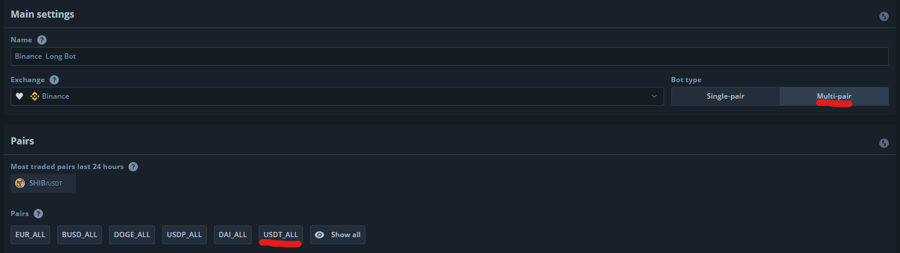
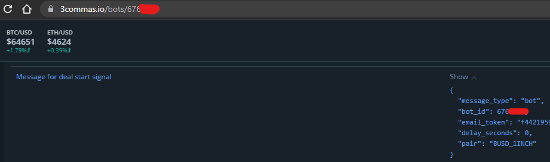
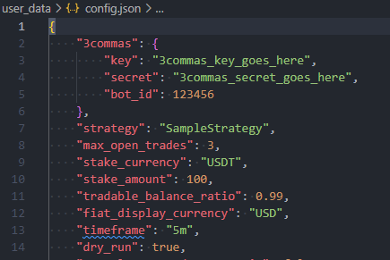

# Freqtrade 3commas wrapper

The aim of this project is to provide an easy way to integrade freqtrade with 3commas. The main reason someone would want to do this is to use the auto DCA feature that 3commas provides and unfortunately freqtrade lacks.

DCA can be risky, especially if used on bad/shit/meme coins, so please use responsably.


# Setup in 3commas

## Make a 3commas account and bot

First you'll need to [create a 3commas account](https://3commas.io/?c=tc331765) and connect 3commas to your exchange.
Then create a multi-pair long bot with the pairs you want to trade. Here you could actually select all pairs (eg. USDT_ALL) and make the more exact pair selection in freqtrade.


Next set the **Deal start condition** to **Manual/API**

After electing the pairs, set your order amounts, safety orders and take profit settings. There are plenty of youtube tutorials explaining what these are.

Once you're happy with the settings click **Create bot**

We will also need to write down the bot_id, this can be found in the API example or URL when looking at the bot.


Now we can start the bot. Since the bot is set to Manual, it won't make any trades.

## 3commas API

In order to control the 3commas bot with freqtrade we'll need a API key and secret.

You can get these by going to https://3commas.io/api_access_tokens and creating a new API key with **BotsRead** and **BotsWrite**

Save the key and secret, we'll need them later.

# Freqtrade setup

Freqtrade has excellent documentation available at https://www.freqtrade.io/en/stable/
Follow the tutorial to get started.

## Add 3commas credential to config.json

Once you've created a freqtrade configuration, you should have a file called **config.json**
Open it in your favorite editor and add the following in the json root:
```json
"3commas": {
	"key": "3commas_key_goes_here",
	"secret": "3commas_secret_goes_here",
	"bot_id": 123456
},
```

Fill that with the 3commas credentials and bot_id from the previous steps and your config.json should look something like this:



## Add the wrapper

Now you'll need to download the 3commas wrapper in the **user_data** directory
```
wget https://raw.githubusercontent.com/AlexBabescu/freqtrade_3commas/master/freqtrade3cw.py
```
The wrapper depends on the **py3cw** package. You will need to install it with
```
pip install py3cw
```
If you are a Docker user, please refer to the freqtrade documentation on how to add additional packages in the freqtrade container - https://www.freqtrade.io/en/stable/docker_quickstart/#additional-dependencies-with-docker-compose

## Using the wrapper in a strategy

All you need is to import Freqtrade3cw into your strategy and decorate the `populate_buy_trend` method.
```
....
from user_data.freqtrade3cw import Freqtrade3cw

class SampleStrategy(IStrategy):
	....

	@Freqtrade3cw.buy_signal
	def populate_buy_trend(self, dataframe: DataFrame, metadata: dict) -> DataFrame:
		....
```


# Limitations and future work

Currently this only supports sending buy signals.

TODO:

* send sell signals
* turn this into a python package

Have fun!